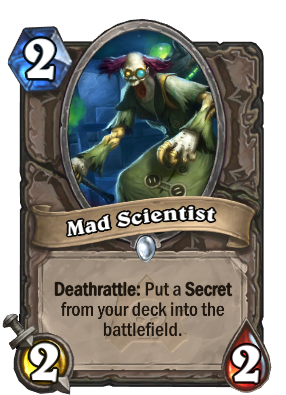

# Another portfolio

## Why would I do this?
It's been quite a while since I create a portfolio. I think I have humbly leveled up my game, so I wanted to showcase it.

Every time that I create a portfolio, I think about the "Mad Scientist"; if you've ever played Hearthstone, every time that you put this card, you'll hear him screaming "I'll show them! I'll show them all!" Here's a [youtube video](https://www.youtube.com/watch?v=MsneaBwYWdg&ab_channel=LFPGaming) that explains it better.

## The serious stuff
Firstly, allow me to comment that this is by no means an example on how to create your portfolio, because I used vanilla CSS, that's right, like the ice cream. This means that for the most part, I had to develop the styling like we were in the 2000s. This is because I learn better this way. 

Don't worry, I used a little bit of [Tailwind CSS](!https://tailwindui.com/), but 85% of the page is built on vanilla CSS.

## Technical languages & libraries
For the frontend I used 
- Vite
- React.js
- CSS
- Javascript
- HTML 

